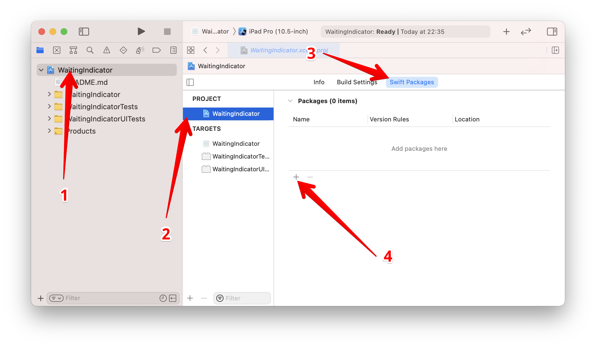

# Swift SQLite

The package simplifies working with SQLite DB file for Swift applications. May
be used on any platform that suports Swift - iOS, macOS, Linux.

A new version is under construction. It's a try to implement a part of JDBC
approach. It should at least:

* Allow performing CRUD operations.
* Work with both - Statement and PreparedStatement.

The old version still works.

## Dependencies

* SQLite3

## How to use

```swift

```

## How to add

### Xcode project

* Add the package to your project. For Xcode project
  select `<porject>` > `<project>` > `Swift Packages` > `+`.



* Then paste `git@github.com:drrost/SSQLite.git` to the text field.

### Another package

To the `Package.swift` file of your package add in `dependencies` section:

```swift
dependencies: [
    .package(
        name: "SSQLite",
        url: "git@github.com:drrost/SSQLite.git",
        from: "1.0.5")
],
```

Then in the same file add to the `targets` section:

```swift
targets: [
    .target(
        name: "YourPackage",
        dependencies: ["SSQLite"]),
    .testTarget(
        name: "YourPackageTests",
        dependencies: ["YourPackage"]),
    ]
```

## License

[MIT](https://choosealicense.com/licenses/mit/)
